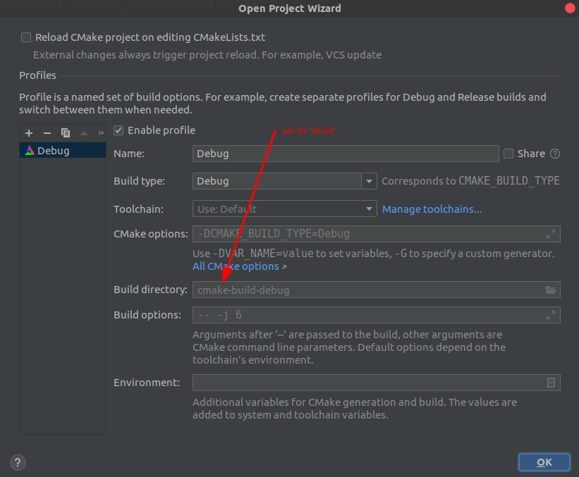
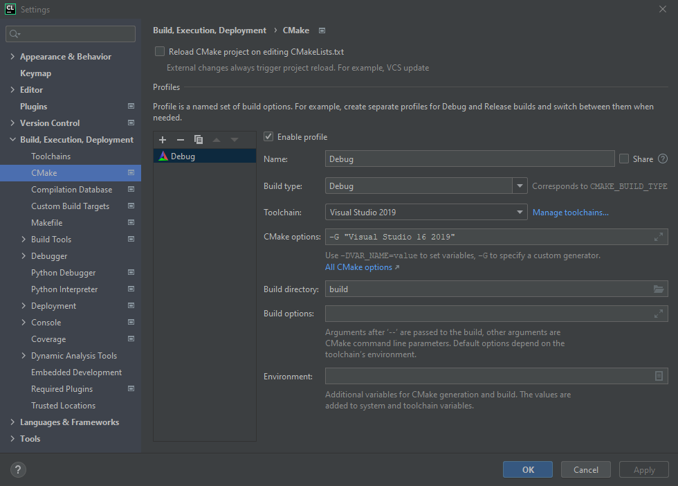

## Configuring CLion for developing a NodeJs C++ Addon 

<!-- TOC -->

- [Configuring CLion for developing a NodeJs C++ Addon](#configuring-clion-for-developing-a-nodejs-c-addon)
  - [CMake](#cmake)
  - [Configuring the project in CLion](#configuring-the-project-in-clion)
    - [Open Project Wizard](#open-project-wizard)
      - [Windows](#windows)
    - [Run/Debug Configuration](#rundebug-configuration)

<!-- /TOC -->

> CLion is a very gifted C/C++ IDE. However we cannot make it work with `node-gyp`. Instead, we're going to configure the project to use `cmake-js`. This will generate the `CMakeLists.txt` file that CLion requires in order to run properly.
>
> You can still use `node-gyp` to build the project, but CLion needs to be configured using `cmake-js`.

### CMake

In order to configure the project to be compatible with CLion, please run `node .scripts/configure.js -i clion -x <buildSystem>`. 

No matter what build system you will choose, the configuration script will still generate the `CMakeLists.txt` file.

### Configuring the project in CLion

#### Open Project Wizard

When opening the project, during the **Open Project Wizzard** process, please set the `Build directory` to `build` as shown in the image bellow.

This will enable nodejs to properly read the compiled libraries.

##### Windows

For Windows, CLion uses as generator for CMake `CodeBlocks - NMake Makefiles` by default which is not the one `cmake-js` will choose.

In my case `cmake-js` chose `Visual Studio 16 2019` as generator, so you will also need to set the CMake generator, by adding something like `-G "Visual Studio 16 2019"` in the `CMake Options` field.

#### Run/Debug Configuration

After opening the project, please amend the **Run/Debug Configuration** as follows:

1. `Executable` must be the path to *node* binary. Please make sure you're setting the correct and proper node binary path. If you're using *nvm* please make sure you're setting the path to the proper version of node, otherwise you will encounter version errors.
2. For the `Program arguments` you can use either a path to 
   * the `main` file as set in the `package.json` or 
   * the path to `mocha` or `jest` binaries in order to run & debug tests
3. For the `Working directory` I recommend using the path to the project folder, since that's the place for any possible data or libaries that you will require during the run/debug sessions.

